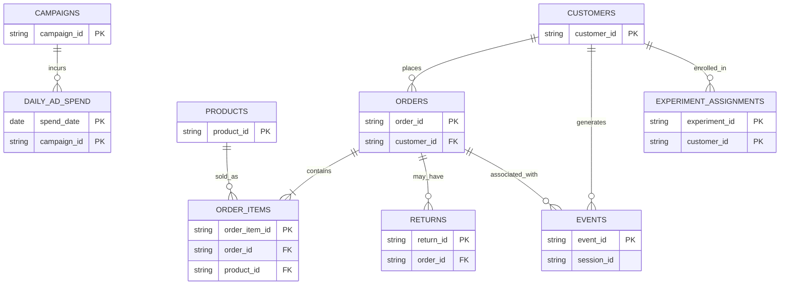

# Entity Relationship Diagram

```mermaid
erDiagram
  CUSTOMERS ||--o{ ORDERS : places
  ORDERS ||--|{ ORDER_ITEMS : contains
  PRODUCTS ||--o{ ORDER_ITEMS : sold_as
  ORDERS ||--o{ RETURNS : may_have
  CUSTOMERS ||--o{ EVENTS : generates
  ORDERS ||--o{ EVENTS : associated_with
  CAMPAIGNS ||--o{ DAILY_AD_SPEND : incurs
  CUSTOMERS ||--o{ EXPERIMENT_ASSIGNMENTS : enrolled_in
  CUSTOMERS { string customer_id PK }
  ORDERS { string order_id PK string customer_id FK }
  ORDER_ITEMS { string order_item_id PK string order_id FK string product_id FK }
  PRODUCTS { string product_id PK }
  RETURNS { string return_id PK string order_id FK }
  EVENTS { string event_id PK string session_id }
  CAMPAIGNS { string campaign_id PK }
  DAILY_AD_SPEND { date spend_date PK string campaign_id PK }
  EXPERIMENT_ASSIGNMENTS { string experiment_id PK string customer_id PK }
```
